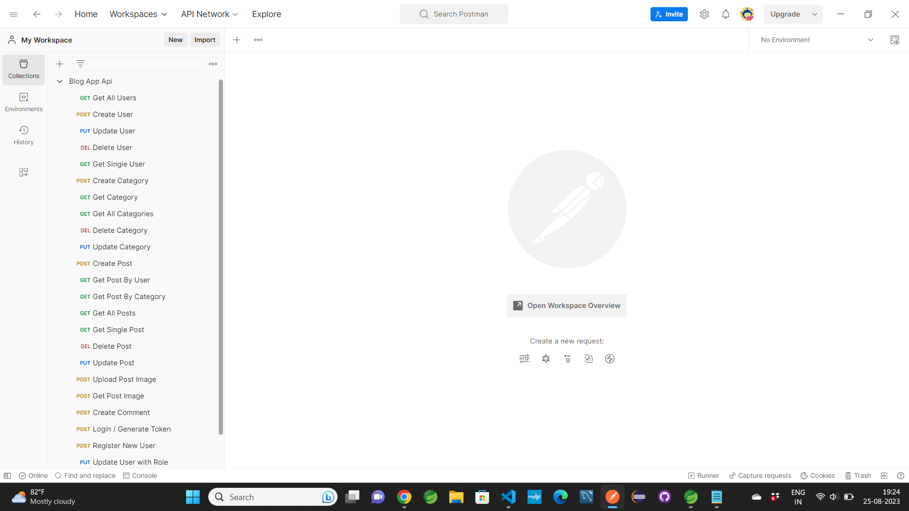
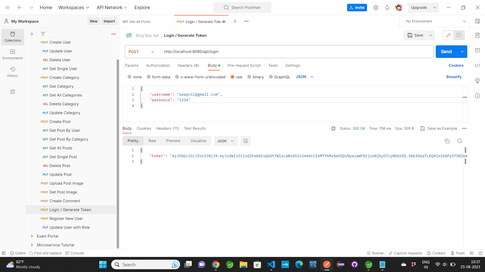
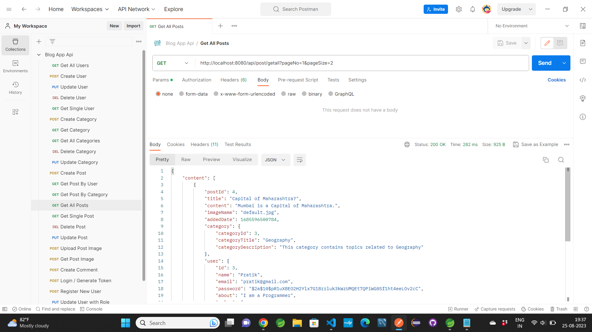
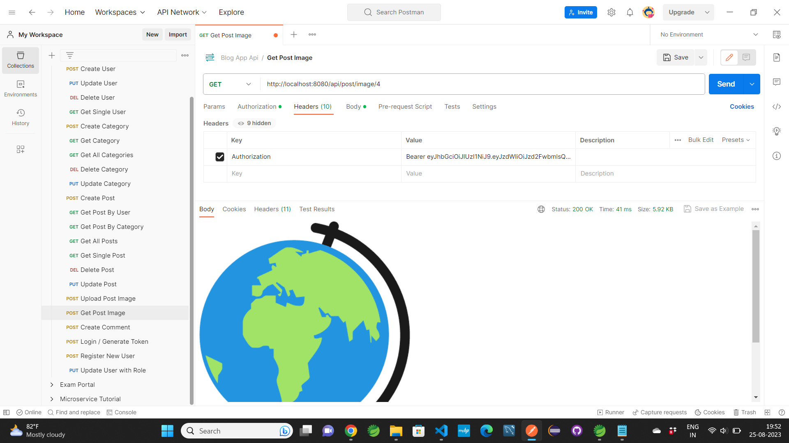
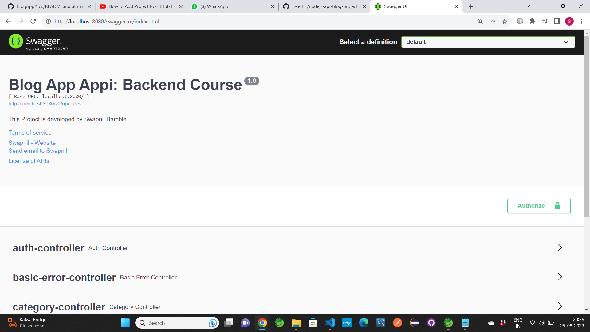
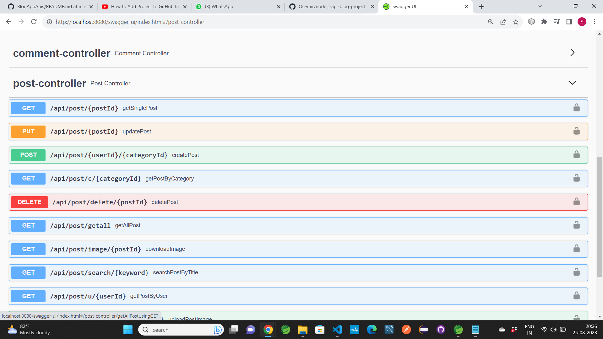

# Blog App Apis
## It is a Backend API's Application. 
- Application to create posts and comments as well as go through the registration and logging user process using a JWT token.
- Swagger implemenation is also done. means you can open it in Browser also

### It is SpringBoot Project. Build in Spring Tool Suite.

### Technology used in this Project: 
- i) Java : all the logic has been written in java. 
- ii) MySQL: MySQL database has been used as database.
- iii) SpringSecurity: SpringSecurity has been used for authentication.
- iv) JWT Token: JWT Token has been used for authentication.
- v) Hibernate: Hibernate ORM is used.

### Software And Tools Required:
- Java JDK 8+ 
- Eclipse EE or Spring Tool Suite
- MySQL

### Steps To Import And Run The Project in Eclipse EE
- In Eclipse or Spring Tool Suite
- Click on File
- Select Import
- Select Projects from Git(with smart import) -> Next
- Select Clone URI -> Next
- In URI paste this url: https://github.com/swapnilbamble1438/BlogAppApis.git
  -> Next
-  Now in Local Destination

-  proceed -> Next

            Now only select BlogAppApis\BlogAppApis
            -> Finish
   
-  If everything goes right Project will get successfully imported
-  Now wait for few seconds for getting things properly loaded

-  Now open Project > src/main/resources > open application.properties file,
   inside this file look for
   
   spring.datasource.url=jdbc:mysql://localhost:3306/springbootnew?serverTimezone=UTC

   here "blogapp2" is the name of the database.
   
     so

   ## create database name "blogapp2" in MySQL.

    or

   (you can also create the database with different name in MySQL. but the created database
   name in MySQL should match the database name in url in application.properties file.
   so according to created database in MySQL set the database name in url in 
   application.properties 
   file.
   - Now save the changes.)
  - And Try to Run the Project

  ### Test the API's in Postman App
 -  Right Click On Project > Run As > Spring Boot App
 -  Open Postman App and Import "Blog App Apis.json" file. 
 -  Now all url's will get imported in Postman App
 -  Now try using those url's.

  ### As Swagger implementation is done You can open it in Browser aswell
 -  Right Click On Project > Run As > Spring Boot App 
 -  Now in Browser Type Url: 	http://localhost:8080/swagger-ui/index.html
 -  Note: In Url put Port according to your application.properties file or you can also use default port.
 -  Application will get Open

### Some Screenshots of this Project:

==================================================================================================================================================================

==================================================================================================================================================================

==================================================================================================================================================================

==================================================================================================================================================================

==================================================================================================================================================================

==================================================================================================================================================================

### Project Creator: Swapnil Bamble

